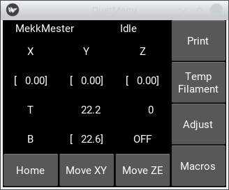
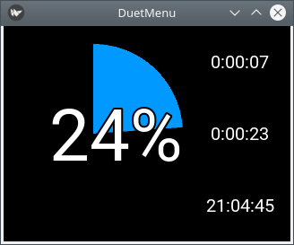

# duetPiLcd

Kivy/Python based touchscreen control for the Duet Wifi (and similar) 3d printer control boards

## What is this?

I always wanted some control next to my [Duet Wifi](https://duet3d.com/DuetWifi) based printer. I never wanted full control, I have the web interface for that, I only need basic movements, start/stop print, macros and most importantly live adjustments during print. I thought the PanelDue would be overkill/overpriced for my needs, so I created this project.

It's based on a Raspberry Pi + Adafruit PiTFT (capacitive), but probably other touchscreens would work as well. It is designed for 320x240 resolution.

## Screenshots




[More screenshots](./screenshots)

## How it connects to the printer?

It uses [Duet Web Control's](https://github.com/chrishamm/DuetWebControl) HTTP GET requests. Make sure you set up URL/PASSWD in duetPiLcd.py for your printer.

## Why PiTFT?

This project actually started on Arduino. Then I realized the 2k RAM is probably not enough for parsing the jsons reported to M408, so I decided to use ESP8266. At that point, the project was very similar to [this one](https://github.com/AdiGitalEU/SUIFD). However, I wanted to be more flexible, so I thought I will use the new Duet Maestro's menu definition system. At that point I shelved the project for a year, and during this time, the Maestor's menu definition language and M408 responses changed slightly, which broke the whole project. 

I realized that I won't be able to keep up with the Duet's developement, and that I have an unused PiTFT, while I have a Pi connected to the printer to handle the camera. I also found kivy, where the kv language made it fairly simple to experiment with various GUI arrangements.

## I found a bug!

Opening an issue here would help others know it, but it's unlikely that I would fix it unless it affects my setup. I do accept pull requests for bugfixes though.

## I need some modification, can you do it for me?

Sorry, no, I don't have the time for that. Feel free to fork and modify the code, and I might accept pull requests too. It's good enough for me, and I won't put too much more effort into this - I might add some fine tuning later on as I start to actually use it.

## I want to modify it, but your code is a mess and there's no documentation!

Sorry - I'm not a professional python developer, and I learnt Kivy just enough to make this.

## Install Kivy on Raspberry Pi using PiTFT

Installing Kivy is a bit complicated and lengthy process thanks to some modification on the Pi graphics libraries which broke old versions of Kivy.

- install raspbian
- install [adafruit pitft](https://learn.adafruit.com/adafruit-pitft-28-inch-resistive-touchscreen-display-raspberry-pi/easy-install-2). Do not enable console, enable mirror
- install kivy by the [guide](https://kivy.org/doc/stable/installation/installation-rpi.html), but:
  - use pip3
  - use kivy.git@1.10.1

Touchscreen (mouse) driver in ~/.kivy/config.ini:
resistive:
```
[input]
mouse = mouse
mtdev_%(name)s = probesysfs,provider=mtdev
hid_%(name)s = probesysfs,provider=hidinput,param=rotation=270,param=invert_y=1
```
capacitive:
```
[input]
mouse = mouse
%(name)s = probesysfs,provider=hidinput
pitft = mtdev,/dev/input/touchscreen,max_position_x=240,max_position_y=320,invert_y=0,invert_x=1,rotation=270
```
